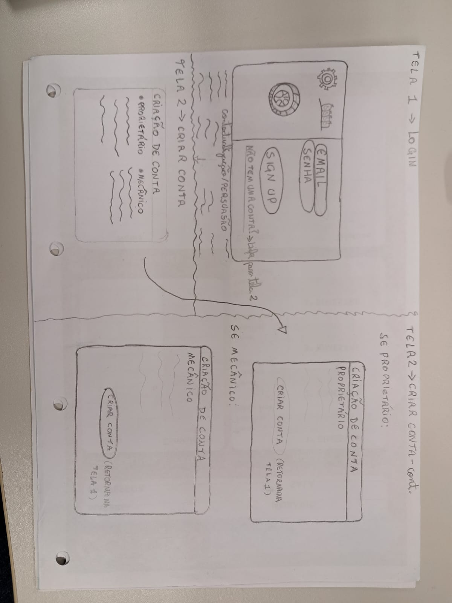

# Sistema de Gestão de Manutenção de Veículos

Trabalho de Experiencia do Usuário (UX) apresentado ao Centro Universitário [FEI](https://portal.fei.edu.br/), como parte dos requisitos necessários para aprovação na disciplina de Experiência do Usuário e Front-End (CCP310) do curso de Ciencia da Computação, orientado pelo Prof. Dr. [Fagner de Assis Moura Pimentel](https://github.com/fagnerpimentel).

## Componentes do Grupo

- Guilherme Gomes dos Santos
- Gabriel Isai Soliz Choque

## Resumo

Sistema web para gestão e manutenção de veículos, voltado para proprietários e mecânicos. A aplicação permite o cadastro de veículos, registro de manutenções, controle de custos e emissão de alertas para revisões futuras, facilitando o planejamento e o histórico de serviços realizados.

## Introdução

A manutenção de veículos é essencial para garantir segurança, desempenho e economia a longo prazo. No entanto, muitos proprietários e até mesmo mecânicos enfrentam dificuldades em manter um controle eficaz sobre revisões, custos e históricos de serviços. Esse sistema surge como uma solução prática e acessível para organizar todas essas informações de forma centralizada.

Objetivo resumido: Oferecer uma ferramenta digital para facilitar o controle de manutenções e custos de veículos, tanto para proprietários quanto para mecânicos.

Experiência esperada pelo usuário: A aplicação deve proporcionar uma navegação simples, com dados visuais claros (dashboards), funcionalidades intuitivas e lembretes automáticos — promovendo praticidade e confiabilidade no controle de veículos.

## Publico Alvo

- Proprietários de veículos que desejam controlar os gastos e histórico de manutenção dos seus automóveis.
- Donos de oficina mecânica, centros automotivos ou mecânicos independentes que desejam registrar seus serviços prestados aos seus clientes.

### Personas

 - Persona primária - Cesar, Proprietário de oficina.

    - Idade: 35 anos.

    - Profissão: Mecânico e dono de um centro automotivo.

    - Contexto: Atende clientes da região e quer melhorar o acompanhamento dos serviços realizados.

    - Nivel de Renda: Média-Alta.

    - Comportamento digital: Usa redes sociais para divulgar a oficina, mas ainda anota os serviços realizados no papel.

    - O que espera do sistema: Um painel simples para registrar os serviços por cliente e enviar lembrentes recorrentes para revisões:

    - Informações que o sistema deve guardar: Dados dos clientes, veículos atendidos, serviços realizados, datas e valores cobrados.
     

- Persona primária - Neide, Proprietária Organizada.

     - Idade: 45 anos.

     - Profissão: Engenheira Civil.

     - Contexto: Usa o carro diariamente para trabalhar e viajar com a família. Preza por economia e manutenção preventiva.

     - Nível de renda: Média.

     - Comportamento digital: Acostumada a usar aplicativos de controle financeiro e produtividade.

     - O que espera do sistema: Facilidade para cadastrar manutenções, receber lembretes e ter uma visão claro dos gastos com seu veículo.

     - Informações que o sistema deve guardar: Nome, e-mail, dados do veículo (modelo,placa,ano), histórico de manutenções, custos e datas de revisão.

---
      
## 📌 Mapa de empatia

Mapa de empatia de duas personas definidas para o sistema de **gestão e manutenção de veículos**:  
- **Persona Primária:** Neide, proprietária organizada (muito chata, exigente, detalhista).  
- **Persona Secundária:** Cesar, mecânico e dono de oficina (muito tranquilo, prático, objetivo).  

---
## 👨 Persona primária — Cesar, Mecânico e dono de oficina

### O que vê
- Oficina movimentada, carros chegando, clientes pedindo serviços.  
- Post-its e anotações antigas grudadas na parede.  
- Redes sociais usadas para divulgar promoções.  

### O que ouve
- Clientes pedindo prazos e explicações simples.  
- Sons típicos da oficina: ferramentas, motores, telefone tocando.  
- Conversas informais com outros mecânicos.  

### O que diz e faz
- Prefere resolver rápido sem burocracia.  
- Anota no papel ou celular de forma simples.  
- Gosta de tratar clientes de forma amigável e prática.  
- Diz que “não tem tempo para complicação”.  

### O que pensa e sente
- Quer manter os clientes satisfeitos sem gastar muito tempo em organização.  
- Acredita que um sistema pode ajudá-lo a reter clientes.  
- Sente tranquilidade quando acompanha tudo de forma simples.  
- Não gosta de excesso de detalhes.  

### Dores
- Perder anotações importantes feitas em papel.  
- Esquecer revisões e datas de retorno de clientes.  
- Sistemas muito complexos que exigem treinamento.  
- Dificuldade em manter contato recorrente com clientes.  

### Ganhos
- Painel prático para registrar serviços.  
- Lembretes automáticos para clientes retornarem.  
- Economia de tempo e fidelização de clientes.  
- Maior confiança dos clientes pela organização.  

---

## 👩 Persona primária — Neide, Proprietária Organizada

### O que vê
- Aplicativos de organização financeira, lembretes no celular, planilhas e dashboards coloridos.  
- Comerciais de revisão preventiva e propagandas de concessionárias.  
- Pessoas comentando sobre gastos altos com manutenção.  

### O que ouve
- Conselhos de amigos e familiares sobre economia com carro.  
- Mecânicos recomendando revisões frequentes.  
- Alertas de aplicativos que usa no dia a dia (banco, saúde, produtividade).  

### O que diz e faz
- Reclama quando não encontra informações claras.  
- Exige detalhamento e quer tudo documentado.  
- Gosta de comparar preços e registrar cada gasto.  
- Cobra respostas rápidas e suporte eficiente.  

### O que pensa e sente
- Quer segurança e organização absoluta no histórico do veículo.  
- Sente ansiedade quando não tem controle dos custos.  
- Tem medo de gastar mais do que deveria por falta de planejamento.  
- Espera que o sistema funcione como um “assistente pessoal”.  

### Dores
- Sistemas confusos ou desorganizados.  
- Falta de relatórios detalhados.  
- Lembretes genéricos e pouco personalizados.  
- Ter que depender da memória ou anotações em papel.  

### Ganhos
- Controle total sobre custos e manutenções.  
- Relatórios visuais e alertas bem configurados.  
- Economia de tempo e dinheiro.  
- Tranquilidade em saber que está prevenindo problemas futuros.  

---

### Conclusão

- **Cesar (primária):** Busca **simplicidade, praticidade e agilidade**.  
- **Neide (primária):** Exige **detalhes, controle e relatórios completos**.  

O sistema deve equilibrar essas necessidades, oferecendo **recursos avançados para usuários exigentes** e, ao mesmo tempo, **uma interface simples e direta para quem busca praticidade**.

## 🌍 Contexto de Uso

### Ambiente de utilização
O serviço será utilizado em dois cenários principais:  
1. **Ambiente pessoal/doméstico** – onde proprietários de veículos (como Neide) acessam a aplicação em casa, no trabalho ou em mobilidade, usando computador ou smartphone.
   Acessa o sistema em seu celular sempre que recebe uma notificação relacionado a revisões que necessitam ser feitas periodicamente em seu automóvel, ja aproveitando para prever dispesas futuras e manter um controle financeiro adequada ao seu orçamento.    

2. **Ambiente profissional/oficina** – onde mecânicos e donos de oficina (como Cesar) utilizam o sistema em meio à rotina de atendimento, registrando informações rapidamente entre um serviço e outro.
   Mecânicos geralmente lidam com orçamentos de mão de obra, orçamentos de peças, horários/prazos de entrega de veículos, enquanto precisam diagnosticar os problemas dos veículos e buscam os meios para solucionar os mesmos.
   Por estarem ocupados diariamente com todos esses afazeres, falta tempo e recurso para manter organizado os históricos de serviços prestados aos clientes, e recordar valores cobrados anteriormente.  

---

### Contextos sociais, econômicos e culturais
- **Sociais:**  
  - Proprietários de veículos preocupados com segurança, organização e economia.  
  - Oficinas e mecânicos buscando fidelizar clientes e manter histórico de serviços.  

- **Econômicos:**  
  - Aumento dos custos de manutenção e peças automotivas.  
  - Necessidade de controlar gastos para evitar surpresas financeiras.  
  - Mecânicos em busca de competitividade no mercado local, utilizando tecnologia como diferencial.  

- **Culturais:**  
  - Uso crescente de aplicativos para organizar finanças, agendas e serviços.  
  - Preferência por soluções digitais que sejam **simples, rápidas e confiáveis**.  
  - Expectativa de receber lembretes automáticos e relatórios visuais claros.  

---

### Informações que o sistema deve guardar antes da interação
- **Para proprietários (Neide):**  
  - Dados pessoais (nome, e-mail).  
  - Informações detalhadas do veículo (modelo, ano, placa, quilometragem).  
  - Histórico de manutenções anteriores.  
  - Preferências de notificação e periodicidade de lembretes.  

- **Para mecânicos (Cesar):**  
  - Dados da oficina e do cliente.  
  - Registro dos serviços já realizados.  
  - Valores cobrados e datas de revisões.  
  - Informações de contato para lembretes automáticos.  

---

### Situação típica durante a interação
- **Proprietário (Neide):**  
  - Está em casa ou no trabalho, analisando custos do veículo.  
  - Pode estar recebendo um lembrete de revisão ou planejando despesas futuras.  
  - Busca praticidade e relatórios detalhados para comparar gastos.  

- **Mecânico (Cesar):**  
  - Está na oficina, com o ambiente movimentado e barulhento.  
  - Pode estar registrando rapidamente um serviço entre atendimentos.  
  - Busca rapidez, simplicidade e lembretes automáticos para manter contato com clientes.  

## Jornada do usuário

## Jornada do Cesar(Mecãnico e dono de oficina)

### 1 - Primeira interação
- Acessa o sistema interessado em obter um atendimento organizado, personalizado e fidelizar seus clientes. Como uma forma de otimizar seu tempo.
- Cadastrar sua oficina (Nome, telefone, email, endereço, CNPJ, CPF, serviços oferecidos e tabela de preço).
- Cadastrar seus clientes (nome, veículo, telefone, email, CPF/CNPJ e endereço).

### 2 - Organização
- Agenda serviços e registra ordem de serviços que estão em andamentos.
- Controla o historico de cada atendimento feito e quando foi realizado, proporcionando uma melhor organização.
- associa os clientes ao veiculos e serviços solicitados.

### 3 - Gestão financeira
- Consulta os relatórios financeiros dos faturamentos e os serviços que foram mais vendidos
- anota o fluxo de clientes semanais e identifica os periodos aonde ocorre o maior movimento.
- transfere os dados para criar relatórios contábeis e fazer planejamentos.

### 4 - Fidelização de clientes
- faz envio automático de lembretes de revisão e troca de óleo.
- analisa quais clientes retornam e quais pararam de vir.
- cria campanhas de promoções sazonais e envia aos clientes.

## Jornada da Neide(Proprietária organizada)

### 1 - Primeira interação
- Acessa o sistema buscando praticidade, organização e segurança para não esquecer revisões importantes.
- Cria uma conta informando os dados pessoais(Nome, telefone, e-mail, CPF, data de nascimento e endereço).
- Cadastra o veículo (Modelo, marca, ano, placa e histórico de manutenções).

### 2 - Registro inicial
- Adiciona as últimas manutenções que foram feitas no veículo
- Indica valores que foram gastos nos serviços ja realizados para gerar relatórios.

### 3 - Relatorio dos custos
- Acessa todos os relatórios anuais e mensais do veículo.
- Cria e visualiza gráficos por categoria de serviços ja feito no automóvel.

### 4 - Controle do histórico
- Visualiza todo o histórico dos serviços ja feitos no veículo, incluindo as datas e custos
- Adiciona observações pessoais relacionado aos serviços.
- Adiciona lembretes de revisões futuras e vencimentos de garantia.

## Análise de concorrência

- Pesquise serviços ou podutos existentes atualmente que possam realizar o objetivo deste projeto.
- Selecione pelo menos 3 serviços ou podutos diferentes.
- Em relação aos concorrentes, respondam as seguintes perguntas?
  - Existe plataforma similar que atende o mesmo mercado e funcionalidades? Se sim: Quais os pontos positivos? Quais os pontos negativos?
  - Existe plataforma diferente quanto ao serviço, mas que atenda esse mercado? Se sim: Quais os pontos positivos? Quais os pontos negativos?

## Coleta de dados

## 1 - Tipo de coleta:
https://docs.google.com/forms/d/e/1FAIpQLScHyF849OKczKYEathKvsZlWT-veXDk2LvuifYBDKcSblhHfg/viewform?usp=dialog

## 2 - Tipo de coleta:
Roteiro de entrevista: 

## -- Perguntas para os proprietários de veículos:

° Quando você está pensando em levar seu carro para a manutenção, o que causa essa decisão?

° Você já passou por alguma situação ruim em alguma oficina? O que aconteceu?

° O que te deixa mais tranquilo no processo de manutenção do seu veículo?

° Se você pudesse ter um recurso extra no celular para conseguir cuidar do seu carro, o que  mais seria útil para você?

## -- Perguntas para mecânicos/donos de oficina:

° No seu dia a dia, qual tarefa administrativa usa a maior parte do seu tempo?

° Quando um cliente deixa de voltar na sua oficina, qual você acha que é o principal motivo?

° Se existisse uma ferramenta que pode resolver apenas um problema da sua oficina, qual problema você escolheria para resolver primeiro?

° Quais recursos você considera indispensável em um sistema de gestão de oficina?

## 3 - Tipo de coleta:
Classificação de cartões: 
## -- Gestão da Oficina (mecânico/dono):

° Tabela de preços dos serviços oferecidos

° Agenda de serviços

° Notificação de agendamentos

° Relatórios financeiros

° Controle de estoque de peças

° Histórico de atendimento

° Comunicação com o clientes (WhatsApp, e-mail, ligação)

° Lembretes de revisão para os clientes

° Controle de pagamentos (recebidos e os pendente)

° Cadastro da oficina

° Cadastro de clientes

° Cadastro de veículos dos clientes

—--------------------------------------

## -- Proprietário de Veículo: 

° Cadastrar o veículo próprio

° Histórico de manutenções do veículo

° Lembretes de troca de óleo

° Lembretes de revisão periódica

° Comparação de custos de todos os serviços usados

° Relatórios de gastos com o carro

° Agendamento online dos serviços

° Receber o orçamento digital

° Consultar os status de serviço

° Avaliar a oficina após atendimento

### Modelo de tarefas

1 -- Modelo:
## -- Cadastrar Oficina (César): 

  Objetivos/Operações                   |               Problemas e recomendações
  
                                        |
                                        
  0. Cadastrar a oficina 1 > 2          | Input: um formulário de cadastro com o nome da oficina, telefone, e-mail, endereço, CNPJ/CPF, serviços oferecidos e a tabela de preços.
                                        | Feedback: a oficina aparece no sistema como “pendente a cadastramento” até que os dados sejam inseridos e confirmados.
                                        | Plano: informar os dados sobre a oficina e depois enviar a confirmação ao dono.
                                        | Recomendação: permitir que o dono da oficina faça o cadastro online sem precisar do suporte de outras pessoas.
     
  ------------------------------------- | ----------------------------------------------------------------------------------------------------------------------------------------------------- 
  
  1. Informar dados da oficina          | Plano: preencher os dados obrigatórios sobre a oficina (nome, endereço, telefone, CNPJ) e cadastrar os serviços ofereçidos e a tabela de preços.
              1+2                       |
     
 -------------------------------------- | --------------------------------------------------------------------------------------------------------------------------------------------------------   
 
  1.1 Informar os dados básicos (nome,  | Problema: os campos longos podem aumentar tempo de preenchimento das respostar. Recomendação: usar o preenchimento automático para acelerar o processo. 
 
 telefone, e-mail, endereço, CNPJ/CPF)  |
 
 -------------------------------------- | -------------------------------------------------------------------------------------------------------------------------------------------------------                                                                     |
  
  1.2 Informar serviços oferecidos e    | Problema: os valores podem variar e precisar de uma atualização rotineira. Recomendação: permitir as importações via planilha ou uma edição rápida de preços.
  
  tabela de preços                      |
 
  ------------------------------------- | ------------------------------------------------------------------------------------------------------------------------------------------------------------------                                                          |
  
  2. Enviar mensagem de confirmação     | Ação: o cadastro deve ser confirmado no prazo que esta estabelecido no site.
  
  do cadastro                           | Recomendação 1: automatizar os envios da mensagem de confirmação usando (WhatsApp/E-mail).
                                        | Recomendação 2: enviar os lembretes caso a confirmação não seja enviada dentro do prazo que tinha sido estabelecido.
                                        
 

 

GOAL 0: Cadastrar a oficina no sistema

GOAL 1: Informar os dados da oficina

METHOD 1.A: Preencher os campos manualmente
 (SEL. RULE: quando o usuário tem todas as informações da oficina com ele)
    OP. 1.A.1: Digitar o nome da oficina
    OP. 1.A.2: Digitar a descrição sobre a oficina
    OP. 1.A.3: Escolher os responsáveis pela oficina
    OP. 1.A.4: Definir as datas de início e fechamento
    OP. 1.A.5: Digitar o local da oficina
    OP. 1.A.6: Escolher o formato de atendimento (presencial ou online)
    
METHOD 1.B: Importar os dados de um arquivo
 (SEL. RULE: quando os dados da oficina foi feita em planilha ou em um documento externo)
    OP. 1.B.1: Clicar no botão “Importar dados”
    OP. 1.B.2: Selecione os arquivos do computador
    OP. 1.B.3: Confirma a importação dos dados
    OP. 1.B.4: Verificar se os dados foram carregados sem erros 

GOAL 2: Adicionar os clientes

METHOD 2.A: a inserção manual
 (SEL. RULE: lista de usuários)
    OP. 2.A.1: Clica em “Adicionar cliente”
    OP. 2.A.2: Digitar o nome, CPF e o e-mail do cliente
    OP. 2.A.3: Repetir os processo para cada cliente do sistema
    
METHOD 2.B: Importar as listas de clientes
 (SEL. RULE: se for lista extensa, em um arquivo externo)
    OP. 2.B.1: Clica em “Importar lista”
    OP. 2.B.2: Seleciona os arquivo tipo (CSV/Excel)
    OP. 2.B.3: Confirmar as  importações feitas
    OP. 2.B.4: Validar se todos os nomes dos clientes foram carregados

GOAL 3: Confirmar o cadastro da oficina

METHOD 3.A: Envio automático da confirmação de cadastro ao dono
    OP. 3.A.1: Clica em “Salvar e confirmar o cadastramento”
    OP. 3.A.2: O sistema envia a notificação para o dono e associados
    OP. 3.A.3: Verificar a mensagem de sucesso recebida do sistema

METHOD 3.B: A revisão antes da confirmação
    OP. 3.B.1: Clica em “Salvar o rascunho”
    OP. 3.B.2: Conferir os dados cadastrados
    OP. 3.B.3: Clicar em “Confirmar o cadastro da oficina”

2 -- Modelo:
## - Cadastras Cliente (Neide):

   Objetivos/Operações                   |               Problemas e recomendações
                                         
   0. Cadastrar cliente                  |   Input: o formulário de cadastro do cliente junto com o nome, telefone, e-mail, CPF e endereço.
                 1 > 2                   |   Feedback: o cliente aparece na lista da oficina como “Cadastrado” após confirmação do cadastro.
                                         |   Plano: informar os dados do cliente e depois confirmar o cadastro do mesmo.
                                         |   Recomendação: permitir um cadastros simplificado (nome + telefone) e poder completar dados depois.
   
   1. Informar os dados do cliente       |  Plano: preencher os dados pessoais e do veículo.
                 1+2+3                   |

   1.1 Informar dados pessoais           |  Plano:  preencher os dados obrigatorios relacionado ao cliente (nome, telefone, e-mail, CPF). / Problema: campos mal preenchidos (ex.: e-mail inválido).
                                         | 
   1.2 Informar endereço                 |  Plano: preencher os dados de  residencia  (rua, número, bairro, cidade e CEP).
                                         |  Problema: o endereço pode ser digitado errado.

   1.3 Informar dados do veículo         |  Plano: preencher os dados do carro do cliente (placa, modelo e ano).
                                         |  Problema: uma placa falsa pode ser cadastrada.

   2. Confirmar os cadastros dos clientes|  Ação: salvar os dados do cliente e vincular na oficina.
                                         |  Recomendação 1: mostrar uma mensagem de sucesso.
                                         |  Recomendação 2: enviar um e-mail/SMS automático de boas-vindas ao cliente.

GOAL 1: Informar os dados do cliente

METHOD 1.A: Inserir manualmente os dados dos clintes
(SEL. RULE: quando o dono da oficina está cadastrando um novo cliente)
    OP. 1.A.1: Clicar em “Adicionar Cliente”
    OP. 1.A.2: Digitar o nome completo do cliente
    OP. 1.A.3: Digitar o CPF ou CNPJ
    OP. 1.A.4: Digitar o telefone do cliente
    OP. 1.A.5: Digitar o e-mail do cliente
    OP. 1.A.6: Digitar o endereço completo do cliente (rua, número, bairro, cidade, CEP)

METHOD 1.B: Importar os dados de um arquivo ja existente
(SEL. RULE: quando tem uma lista de clientes já organizada em uma planilha ou sistema anterior)
    OP. 1.B.1: Clicar em “Importar clientes”
    OP. 1.B.2: Selecionar os arquivo no formato ex(CSV/Excel(
    OP. 1.B.3: Confirmar a importação dos dados dos clientes
    OP. 1.B.4: Valida se todos os dados dos clientes foram carregados sem erros

GOAL 2: Informar os dados do veículo do cliente

METHOD 2.A: O cadastro manual
(SEL. RULE: quando o cliente fornece as informações de um único veículo)
    OP. 2.A.1: Digitar a placa do veículo
    OP. 2.A.2: Digitar o modelo do veículo
    OP. 2.A.3: Digitar o ano de fabricação do veículo
    OP. 2.A.4: Digitar a quilometragem atual do veículo

METHOD 2.B: Importar os dados de varios carros
(SEL. RULE: quando o cliente possui mais de um veículo e já tem uma lista pronta)
    OP. 2.B.1: Clicar em “Importar os veículos”
    OP. 2.B.2: Selecionar o arquivo contendo as informações dos veículos
    OP. 2.B.3: Confirmar a importação
    OP. 2.B.4: Verificar se todos os veículos foram adicionados ao cliente certo

GOAL 3: Confirmar o cadastro do cliente

METHOD 3.A: A confirmação direta
    OP. 3.A.1: Clicar em “Salvar e confirmar cadastro”
    OP. 3.A.2: O sistema salva e vincula o cadastro do cliente e o veículo na oficina
    OP. 3.A.3: Verifica a mensagem de sucesso

METHOD 3.B: Revisar antes de confirmação
    OP. 3.B.1: Clicar em “Salvar rascunho”
    OP. 3.B.2: Conferir os dados do cliente e do veículo
    OP. 3.B.3: Clicar em “Confirmar cadastro”
    OP. 3.B.4: O sistema envia uma notificação de confirmação ao cliente
      
    
### Design
1) 

Item                               |                                                  Descrição                                                              |                                                     Justificativa
Software e Hardware                |                O sistema será feito para navegadores web (Chrome, Edge, Firefox) usando HTML, CSS e o JavaScript.       |            Como o foco é o front-end, essas ferramentas vão ajudar na padronização visual e permitir uma                                          |                As interfaces serão feitas no Figma e o fluxo de interação com o usuário será feito no Molic.            |             validação rápida pelo usuário.
                                   |                                                                                                                         |
-----------------------------------------------------------------------------------------------------------------------------------------------------------------------------------------------------------------------------------------------------------------------
                                                                                                                                                             
Capacidades da plataforma          |                uma interface boa e compatível com as telas de notebook, desktop e celulares                             |             Os usuários podem acessar o sistema em diferentes dispositivos; assim  melhorando a                                                   |                                                                                                                         |              experiência.
----------------------------------------------------------------------------------------------------------------------------------------------------------------------------------------------------------------------------------------------------------------------
                                                                                                                                                             
Restrições da plataforma           |                 O sistema dependerá de conexão com a internet e de navegadores modernos com um suporte a HTML5.         |            O uso offline não vai ser suportado e em alguns navegadores antigos podem apresentar falhas.
                                   |                                                                                                                         |

2)

Contexto de uso –                                                                                              Nome da referência –                                                                      Descrição da referéncia  -
O serviço vai ser utilizado em dois cenários principais:                                          ISO 9241-210 – Ergonomia da interação humano-sistema                     Define os princípios de design centrado no usuário e garantindo que o sistema seja       o ambiente pessoal/doméstico (os usuários como a Neide, que acessam o sistema em casa,                                                                                       eficaz, eficiente e possibilite uma boa experiência ao usuário.
                                                                                                                                                                           É fundamental que o dono da oficina quanto o cliente consiga usar o sistema de forma fácil.
no trabalho ou pelo celular para acompanhar as revisões e despesas de seu veículo)
e os ambiente profissionais/oficina (usuários como o Cesar, mecânicos e donos de oficina,
que registram as informações dos clientes, serviços e peças usadas enquanto trabalham).

### Prototipação em baixo nível (papel)

#### Avaliação heurística

### Prtotipação em médio nível (Figma)
#### [https://morph-syrup-55891458.figma.site/](https://morph-syrup-55891458.figma.site)
#### Avaliação heurística

[^1]: Fonte: Adaptado de <https://hazeshift.com.br/mapa-de-empatia/>

<!-- TODOs:
- Add exemplos
 -->

